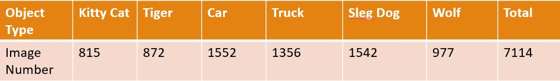
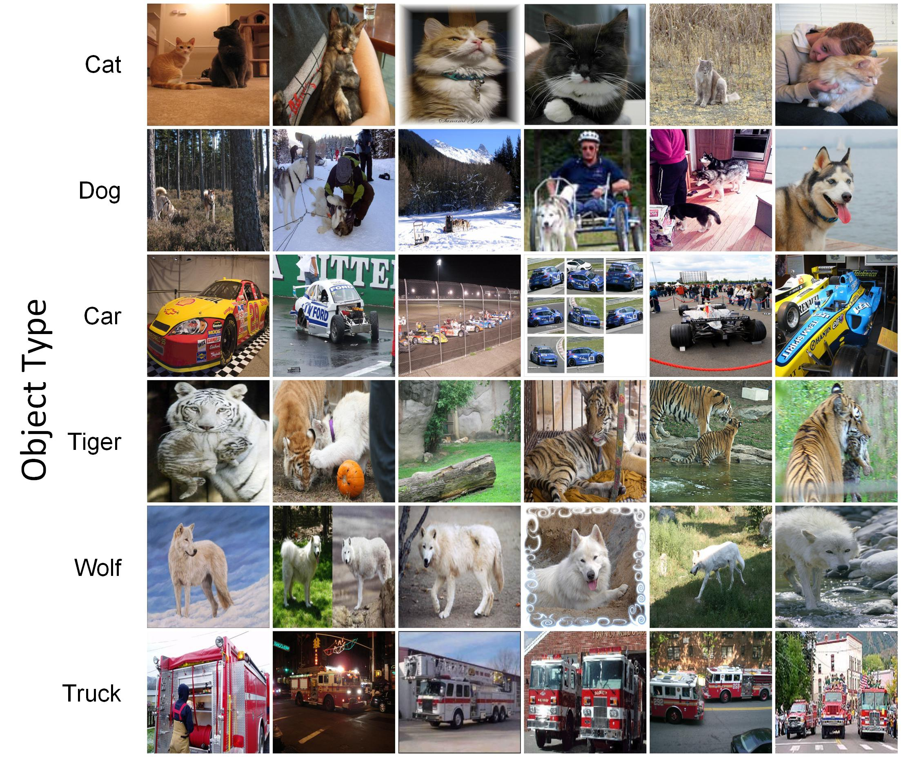

# ImageNet-Based-Dataset-for-Transfer-Learning
## 1. Introduction  
- A good dataset is extremely important to comprehensively evaluate the performace of a transfer learning method. However, we can see that in many papers the small-scale datasets such as Office-Caltech 10 and Office 31 are still widely used in experiments relating to the deep transfer networks which require to be trained under large amounts of data. The small-scale dataset will severely restrain the performance of deep transfer networks. Hereby, we hope to standardrize this ImageNet based dataset to ease the future research on deep transfer neural networks.  
- The authors hope and welcome all of the researchers and readers sharing this passion to participate in enriching this dataset. This ImageNet based dataset could be updated by pulling a request to merge the current version. 

## 2. Features of this dataset
- This dataset consists of 6 categories which can be divided into two domains for studying transfer learning, namely {cat, dog, car} and {tiger, wolf, truck}, and has 7,114 images in total. The number of images per category is shown as follows:  
  
- The image number per category averages 1185 and is with a minimum of 815 and a maximum of 1552.  
- The image samples of each category are shown as below figure.  
  

 ## 3. The generation method of this dataset  
The images are all downloaded from each image node of [ImageNet](http://www.image-net.org/). The detailed information of each image node are listed below  
|Category|Detailed Information|  
|--------|--------------------|  
|**Cat**|It refers to "kitty, kitty-cat, puss, pussy, pussycat", which is under the node of "domestic animal" in ImageNet. The image urls can be found in [here](http://image-net.org/api/text/imagenet.synset.geturls?wnid=n02122298).|  
|**Dog**|"Eskimo dog", link|  
|**Car**|"racer, race car, racing car"|  
|**Tiger**|"tiger, Panthera tigris"|  
|**Wolf**|"white wolf, Arctic wolf"|  
|**Truck**|"fire engine, fire truck"|  

## 4. How to use
We provide the interface in Pytorch to conveniently use the above dataset for developing your applications. Merely two steps for setup.
- Firstly, modify the root path of ImageNet based dataset and the folder name of each caterogy in [generate.py](generate.py), and then run 
  ```
  python generate.py
  ```  
- Secondly, add the file [generic_dataset.py](generic_dataset.py) to your appication, and import the GenericDataset class to your code. The usage example can be found in [generic_dataset.py](generic_dataset.py).
 

